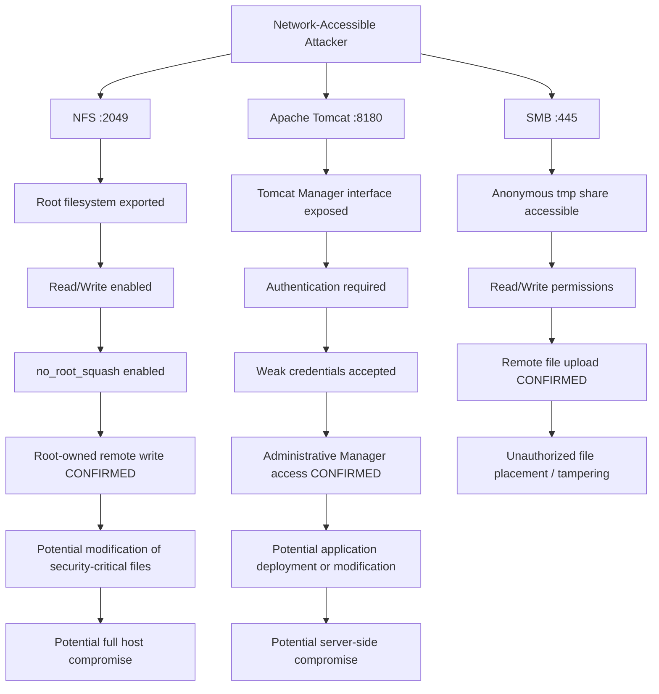

# Attack Path Analysis

## Overview

Attack-path analysis was performed to understand how the confirmed weaknesses identified during the assessment could contribute to broader compromise of the simulated enterprise server.

The assessment identified **three independent attack avenues** from the perspective of an attacker with network access to the controlled environment:

- NFS on TCP/2049
- Apache Tomcat on TCP/8180
- SMB on TCP/445

These paths were analyzed separately.

The assessment did **not** demonstrate lateral movement between hosts, and the findings were not artificially combined into a multi-stage attack chain.

---

## Attack Path Diagram



---

## Confirmed vs. Potential Impact

The attack-path analysis separates:

```text
Confirmed assessment evidence
```

from:

```text
Potential downstream consequences
```

This distinction is important because testing intentionally stopped once sufficient evidence had been collected.

Potential impact is therefore not presented as if it was directly executed during the assessment.

---

# Attack Avenue 1 — NFS

## Entry Point

```text
TCP/2049
```

The target exposed the Network File System service to the assessment network.

Enumeration identified the following export:

```text
/ *
```

Inspection of the export configuration identified:

```text
/ *(rw,sync,no_root_squash,no_subtree_check)
```

---

## Attack Progression

```text
Network access to NFS
        ↓
Root filesystem exported
        ↓
Export accessible from assessment workstation
        ↓
Read/write permissions enabled
        ↓
no_root_squash preserves remote root identity
        ↓
Remote root-owned file creation CONFIRMED
```

---

## Confirmed Impact

Manual validation confirmed that a privileged user on the assessment workstation could create a file on the target filesystem with:

```text
root root
```

ownership.

This demonstrated:

- Remote filesystem modification
- Preservation of remote root identity
- Privileged write access to the target filesystem

This was the strongest attack avenue identified during the assessment.

---

## Potential Downstream Impact

The confirmed filesystem privileges could potentially allow modification of:

- Authentication files
- SSH configuration
- Authorized keys
- Scheduled tasks
- Startup scripts
- Application configuration
- Service configuration
- Web application content

These actions could potentially lead to persistent or full-system compromise.

They were **not performed during the assessment**.

---

## Validation Boundary

Testing stopped after controlled root-owned file creation.

The assessment did not:

- Modify `/etc/passwd`
- Modify `/etc/shadow`
- Add SSH keys
- Create new privileged users
- Establish persistence
- Replace binaries
- Execute malicious code

The controlled write test was sufficient to demonstrate the vulnerability.

Related finding:

[`../findings/F001-unrestricted-nfs-root-filesystem-export.md`](../findings/F001-unrestricted-nfs-root-filesystem-export.md)

---

# Attack Avenue 2 — Apache Tomcat Manager

## Entry Point

```text
TCP/8180
```

Web enumeration identified an exposed Apache Tomcat service and the administrative Manager interface:

```text
/manager/html
```

---

## Attack Progression

```text
Network access to TCP/8180
        ↓
Tomcat Manager discovered
        ↓
Unauthenticated request
        ↓
401 Unauthorized
        ↓
Weak credentials tested
        ↓
tomcat:tomcat accepted
        ↓
200 OK
        ↓
Administrative Manager access CONFIRMED
```

---

## Confirmed Impact

The assessment confirmed access to the **Tomcat Web Application Manager** administrative interface.

Evidence included:

- HTTP `401 Unauthorized` without credentials
- HTTP `200 OK` with `tomcat:tomcat`
- Successful browser access to the Manager interface

This demonstrated unauthorized administrative application access.

---

## Potential Downstream Impact

Depending on the privileges assigned to the compromised account, Tomcat Manager access could potentially allow:

- Application deployment
- Application modification
- Application removal
- Application restart or disruption
- Introduction of unauthorized server-side content
- Potential server-side code execution

These actions were **not performed during the assessment**.

---

## Validation Boundary

Testing stopped after administrative access was confirmed.

The assessment did not:

- Upload a WAR file
- Deploy malicious application content
- Execute operating-system commands
- Establish a reverse shell
- Create persistence
- Modify existing applications

The authentication weakness was sufficiently demonstrated without further exploitation.

Related finding:

[`../findings/F003-tomcat-manager-weak-credentials.md`](../findings/F003-tomcat-manager-weak-credentials.md)

---

# Attack Avenue 3 — SMB

## Entry Point

```text
TCP/445
```

SMB enumeration identified anonymously accessible network shares.

The `tmp` share was selected for manual validation.

---

## Attack Progression

```text
Network access to SMB
        ↓
Anonymous share enumeration
        ↓
tmp share accessible without credentials
        ↓
Read/Write access identified
        ↓
Anonymous connection confirmed
        ↓
Controlled file upload CONFIRMED
        ↓
Unauthorized file placement demonstrated
```

---

## Confirmed Impact

Manual testing confirmed that an unauthenticated user could:

- Connect to the SMB `tmp` share
- Enumerate its contents
- Upload a controlled file
- Verify the uploaded file remotely
- Remove the assessment-created file

This demonstrated unauthorized modification capability within the affected share.

---

## Potential Downstream Impact

In a production environment, writable network shares may introduce additional risk where other users or applications consume the uploaded content.

Potential consequences could include:

- Shared-data tampering
- Storage of unauthorized content
- Introduction of malicious files
- Application interaction with attacker-controlled data

These outcomes depend on environmental conditions that were **not established during this assessment**.

---

## Validation Boundary

The assessment did not demonstrate:

- Code execution
- Privileged file modification
- Application execution of uploaded content
- Privilege escalation
- Host compromise
- Lateral movement

The finding is therefore treated as a confirmed access-control weakness rather than a demonstrated path to full system compromise.

Related finding:

[`../findings/F002-anonymous-smb-read-write-access.md`](../findings/F002-anonymous-smb-read-write-access.md)

---

# Supporting Security Observations

Two additional conditions contributed to the overall attack-surface assessment but were not treated as primary attack paths.

---

## Anonymous FTP

Anonymous FTP authentication was confirmed on TCP/21.

However:

```text
Anonymous login        → Confirmed
Meaningful file access → Not identified
Anonymous upload       → Denied
```

The issue therefore remained a **Low-priority security observation**.

Related observation:

[`../observations/O001-anonymous-ftp-access.md`](../observations/O001-anonymous-ftp-access.md)

---

## SMBv1

SMB protocol enumeration confirmed support for:

```text
NT LM 0.12 (SMBv1)
```

However, no SMBv1-specific vulnerability or CVE was exploited or validated.

The condition therefore remained a **Medium-priority security observation** rather than a confirmed attack path.

Related observation:

[`../observations/O002-legacy-smbv1-protocol-enabled.md`](../observations/O002-legacy-smbv1-protocol-enabled.md)

---

# Attack Path Comparison

| Attack Avenue | Authentication Required | Confirmed Access | Demonstrated Impact | Risk |
|---|---|---|---|---|
| NFS | No application-level authentication | Root filesystem | Root-owned remote filesystem write | Critical |
| Tomcat Manager | Yes, but weak credentials accepted | Administrative interface | Unauthorized administrative access | High |
| SMB `tmp` | No | Writable network share | Unauthorized remote file placement | Medium |

---

# Prioritization

## 1. NFS — Highest Priority

NFS represented the most significant attack avenue because testing directly demonstrated privileged remote filesystem modification.

The combination of:

```text
Root filesystem export
+
Read/Write
+
no_root_squash
```

provided sufficient evidence of a direct path toward host compromise.

---

## 2. Tomcat Manager — High Priority

Tomcat Manager represented the second most significant attack avenue.

Weak credentials provided access to an administrative application-management interface.

Although full server compromise was not tested, the confirmed administrative access justified a High severity.

---

## 3. SMB — Medium Priority

Anonymous SMB write access represented a meaningful access-control weakness.

However, the assessment demonstrated only unauthorized file placement within the writable share.

No evidence established privileged execution or direct host compromise.

The finding therefore remained Medium severity.

---

# Attack Path Conclusion

The assessment identified three independent network-accessible attack avenues:

```text
NFS
→ Privileged filesystem modification confirmed

Tomcat Manager
→ Unauthorized administrative access confirmed

SMB
→ Unauthorized remote file placement confirmed
```

The NFS weakness represented the most direct path toward privileged host compromise.

The Tomcat weakness provided administrative application access with potential for greater compromise if further exploitation were performed.

The SMB weakness provided unauthorized modification capability but with more limited demonstrated impact.

Importantly, the assessment did not claim:

- Lateral movement
- Multi-host compromise
- Chained exploitation
- Full host compromise
- Code execution where it was not demonstrated

This distinction ensures that the attack-path analysis remains directly supported by the evidence collected during the engagement.
