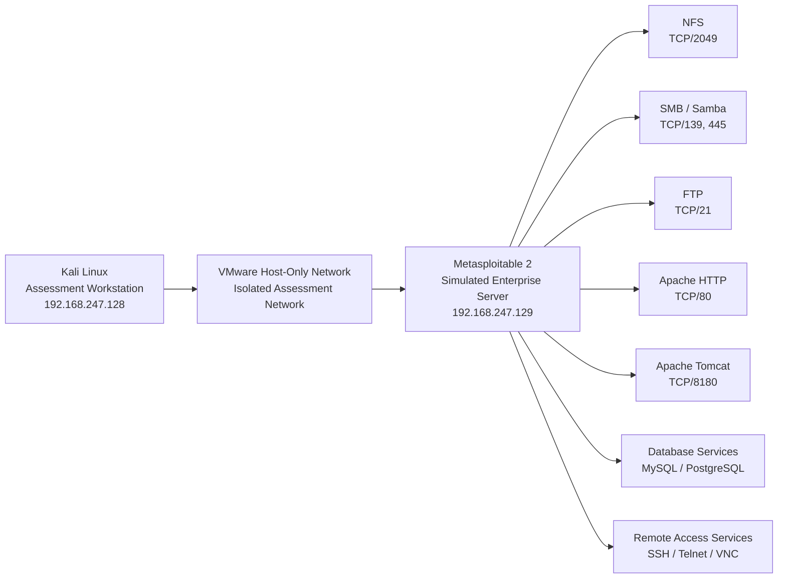

# Network Architecture

## Overview

The assessment was conducted within an isolated VMware lab environment created for the simulated cybersecurity assessment of **Asteria Solutions Sdn. Bhd.**

The environment contained:

- One Kali Linux security assessment workstation
- One intentionally vulnerable Metasploitable 2 server
- A VMware host-only network connecting both systems

All security testing was performed against the Metasploitable 2 target from the Kali Linux workstation.

No production systems, public infrastructure, or third-party systems were included.

---

## Architecture Diagram



---

## Asset Summary

| Asset ID | System | IP Address | Role | Assessment Status |
|---|---|---|---|---|
| AS-01 | Kali Linux | `192.168.247.128` | Security Assessment Workstation | Not a Target |
| TG-01 | Metasploitable 2 | `192.168.247.129` | Simulated Enterprise Server | In Scope |

---

## Network Segmentation

The environment used a **VMware host-only network**.

This configuration provided network connectivity between the assessment workstation and the target while keeping the intentionally vulnerable server isolated from external networks.

```text
Assessment Workstation
192.168.247.128
        |
        |
VMware Host-Only Network
        |
        |
Simulated Enterprise Server
192.168.247.129
```

The network architecture was deliberately small because the purpose of the project was to demonstrate a structured cybersecurity assessment rather than reproduce a full production enterprise network.

---

## Primary Services Investigated

Although reconnaissance identified 23 open TCP ports, deeper assessment focused on four primary service areas.

### NFS

```text
TCP/2049
```

Investigation focused on:

- Export enumeration
- Filesystem exposure
- Read/write permissions
- Root privilege handling

Result:

**F-001 — Unrestricted NFS Root Filesystem Export with Root Privilege Preservation**

---

### SMB / Samba

```text
TCP/139
TCP/445
```

Investigation focused on:

- Anonymous share enumeration
- Share permissions
- Remote write capability
- Supported SMB protocol versions

Results:

**F-002 — Anonymous Read/Write Access to SMB Temporary Share**

**O-002 — Legacy SMBv1 Protocol Enabled**

---

### Apache Tomcat

```text
TCP/8180
```

Investigation focused on:

- Administrative-interface exposure
- Authentication requirements
- Weak credential validation

Result:

**F-003 — Weak Credentials Permit Unauthorized Access to Apache Tomcat Manager**

---

### FTP

```text
TCP/21
```

Investigation focused on:

- Anonymous authentication
- Exposed directory contents
- Remote write permissions
- Transport security

Result:

**O-001 — Anonymous FTP Access with Plaintext Transport**

---

## Assessment Traffic Flow

The general testing flow was:

```text
Kali Linux
192.168.247.128
        |
        | Authorized assessment traffic
        v
Metasploitable 2
192.168.247.129
        |
        +-- TCP/21   → FTP
        +-- TCP/80   → Apache HTTP
        +-- TCP/139  → SMB
        +-- TCP/445  → SMB
        +-- TCP/2049 → NFS
        +-- TCP/8180 → Apache Tomcat
```

All validation activity remained within the defined lab environment.

---

## Security Boundary

The assessment boundary can be represented as:

```text
+------------------------------------------------------+
|            Controlled VMware Lab Environment         |
|                                                      |
|   +-------------------+       +-------------------+  |
|   | Kali Linux        |       | Metasploitable 2  |  |
|   | 192.168.247.128   | ----> | 192.168.247.129   |  |
|   | Assessment System |       | Assessment Target |  |
|   +-------------------+       +-------------------+  |
|                                                      |
+------------------------------------------------------+

               No authorized testing beyond
                    this boundary
```

---

## Assessment Limitations

This architecture represents a **single-target simulated enterprise environment**.

The assessment did not include:

- Active Directory
- Multiple enterprise servers
- Lateral movement between hosts
- Cloud infrastructure
- Wireless networks
- Production user endpoints
- Internet-facing perimeter infrastructure

These limitations were intentional and allowed the assessment to focus on detailed validation and documentation of selected security weaknesses.

---

## Related Documentation

- [`../documentation/environment.md`](../documentation/environment.md)
- [`../documentation/scope-and-rules-of-engagement.md`](../documentation/scope-and-rules-of-engagement.md)
- [`../documentation/reconnaissance.md`](../documentation/reconnaissance.md)
- [`attack-path.md`](attack-path.md)
